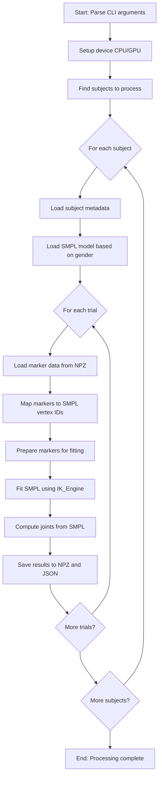

# SMPL Fitting with VPoser IK_Engine

## Overview

The `fit_markers.py` script replaces the custom optimization in `2_fit_smpl_markers.py` with the human_body_prior library's IK_Engine, which uses VPoser prior for more robust SMPL parameter estimation. This script performs inverse kinematics (IK) to fit SMPL body model parameters to motion capture marker data from the Van Criekinge dataset.

## Installation and Setup

### 1. Activate UV Environment

```bash
cd human_body_prior
uv sync
```

### 2. Install pytorch3d (Special Instructions)

The `pytorch3d` library requires special installation due to compilation requirements:

```bash
# Limit to 4 parallel jobs (safe for 32GB RAM)
export MAX_JOBS=4 

# Install pytorch3d from source with no build isolation
uv pip install "git+https://github.com/facebookresearch/pytorch3d.git" --no-build-isolation
```

**Note:** This installation may take 10-15 minutes depending on your system. The `--no-build-isolation` flag is required for proper compilation.

### 3. Download Required Models

Before running the script, ensure you have:

1. **VPoser v2.05 model** in `human_body_prior/support_data/dowloads/V02_05/`
   - Contains `.ckpt` files and `V02_05.yaml` configuration
   - Available from SMPL-X website

2. **SMPL body models** in `data/smpl/`
   - `SMPL_MALE.npz`, `SMPL_FEMALE.npz`, `SMPL_NEUTRAL.npz`
   - Available from SMPL website

## Usage

### Basic Usage

```bash
cd human_body_prior
uv run python -m src.fit_markers \
  --processed_dir ../data/processed_markers_all_2 \
  --models_dir ../data/smpl \
  --out_dir ../data/fitted_smpl_all_3_new
```

### Command Line Arguments

| Argument | Description | Default |
|----------|-------------|---------|
| `--processed_dir` | Path to processed markers (output of Step 1) | Required |
| `--models_dir` | Path to SMPL models directory | Required |
| `--out_dir` | Output directory for fitted SMPL parameters | Required |
| `--subject` | Process specific subject only (e.g., SUBJ01) | All subjects |
| `--trial` | Process specific trial only (e.g., SUBJ1_0) | All trials |
| `--device` | Device to use ('cpu' or 'cuda') | 'cuda' |
| `--batch_size` | Maximum frames per batch | 128 |
| `--vicon_up` | Vicon up axis ('X', 'Y', or 'Z') | 'Z' |
| `--vicon_forward` | Vicon forward axis ('X', 'Y', or 'Z') | 'Y' |

### Examples

```bash
# Process all subjects and trials
uv run python -m src.fit_markers \
  --processed_dir ../data/processed_markers_all_2 \
  --models_dir ../data/smpl \
  --out_dir ../data/fitted_smpl_all_3_new \
  --device cpu

# Process specific subject
uv run python -m src.fit_markers \
  --processed_dir ../data/processed_markers_all_2 \
  --models_dir ../data/smpl \
  --out_dir ../data/fitted_smpl_all_3_new \
  --subject SUBJ01

# Process specific trial
uv run python -m src.fit_markers \
  --processed_dir ../data/processed_markers_all_2 \
  --models_dir ../data/smpl \
  --out_dir ../data/fitted_smpl_all_3_new \
  --device cuda \
  --subject SUBJ01 --trial SUBJ1_0
```

## What Results Do We Get?

The script produces two types of output files for each trial:

### 1. SMPL Parameters File (`*_smpl_params.npz`)

Contains all SMPL parameters in the same format as the original pipeline:

```python
import numpy as np
data = np.load('SUBJ1_0_smpl_params.npz', allow_pickle=True)

# Keys in the NPZ file:
# - 'poses': (T, 72) - 3 root_orient + 63 pose_body + 6 hand zeros
# - 'trans': (T, 3) - global translation
# - 'betas': (10,) - shape parameters
# - 'joints': (T, 24, 3) - SMPL joint positions
# - 'gender': str - model gender
# - 'subject_id': str - subject ID
# - 'trial_name': str - trial name
# - 'fps': float - frame rate
# - 'n_frames': int - number of frames
```

### 2. Metadata File (`*_smpl_metadata.json`)

Contains detailed information about the fitting process:

```json
{
  "subject_id": "SUBJ01",
  "trial_name": "SUBJ1_0",
  "gender": "male",
  "frames_fitted": 17,
  "fps": 20.0,
  "markers_used": ["LASI", "RASI", "LPSI", "RPSI", ...],
  "vertex_ids": [3021, 6729, 3056, 6779, ...],
  "settings": {
    "vicon_up": "Z",
    "vicon_forward": "Y",
    "batch_size": 64,
    "device": "cpu"
  }
}
```

## How to Examine Results

### Using `render_smpl_mesh_live.py`

The best way to visualize the results is using the interactive visualization script:

```bash
python render_smpl_mesh_live.py --subject 01 --scene 0 --model male
```

**Controls:**
- **Frame Slider**: Frame scrubbing (auto-pauses)
- **Beta Slider**: Adjust body shape (-10 to +10, uniform "fatness")
- **Override Checkbox**: Enable/disable beta slider override
- **Play/Pause**: Toggle animation playback
- **Left/Right Arrows**: Rotate camera horizontally (azimuth ±15°)
- **Up/Down Arrows**: Tilt camera vertically (elevation ±10°)
- **Scroll Up/Down**: Zoom in/out (distance ±0.5)
- **Spacebar**: Play/Pause toggle

### Using `view_smpl_params.py`

For a quick joint-based visualization:

```bash
python view_smpl_params.py --subject SUBJ01 --trial SUBJ1_0
```

## How the Script Works

### Program Execution Flow



### Key Functions

#### 1. `map_markers_to_vertex_ids(marker_names)`
- Maps Van Criekinge marker names to SMPL vertex IDs
- Uses `labels_map.py` for canonical name conversion
- Uses `marker_vids.py` for vertex ID lookup
- Only ~35/111 markers map to SMPL vertices (core Plug-in Gait markers)

#### 2. `vicon_to_smpl_coords(points, vicon_up, vicon_forward)`
- Converts coordinates from Vicon to SMPL system
- Default: Vicon (Z-up, Y-forward) → SMPL (Y-up, Z-forward)
- Applies appropriate rotation matrices

#### 3. `fit_sequence_with_ik_engine(markers_torch, vids, bm_fname, device, batch_size)`
- Core optimization using human_body_prior IK_Engine
- Uses VPoser v2.05 as pose prior
- L-BFGS optimizer with 300 max iterations
- Loss weights: data=10.0, poZ_body=0.01, betas=0.5
- Splits long sequences into batches for memory efficiency

#### 4. `create_source_keypoints(bm_fname, vids, device)`
- Creates PyTorch module that computes virtual markers from SMPL parameters
- Virtual markers = vertex positions + 0.0095m offset along normals
- Adapted from `ik_example_mocap.py`

### Marker Mapping Process

The script performs a two-step marker mapping:

1. **Canonical Name Conversion** (via `labels_map.py`):
   ```
   Raw marker → Canonical name
   "LASI" → "LASI"
   "RASI" → "RASI"
   "LPSI" → "LPSI"
   "RPSI" → "RPSI"
   ```

2. **Vertex ID Lookup** (via `marker_vids.py`):
   ```
   Canonical name → SMPL vertex ID
   "LASI" → 3021
   "RASI" → 6729
   "LPSI" → 3056
   "RPSI" → 6779
   ```

## Technical Details

### Coordinate Systems

- **Vicon Default**: Z-up, Y-forward
- **SMPL Default**: Y-up, Z-forward
- **Transformation**: Rotate -90° around X-axis

### Optimization Parameters

```python
# From ik_example_mocap.py
data_loss = torch.nn.MSELoss(reduction="sum")
stepwise_weights = [{"data": 10.0, "poZ_body": 0.01, "betas": 0.5}]
optimizer_args = {
    "type": "LBFGS",
    "max_iter": 300,
    "lr": 1,
    "tolerance_change": 1e-4,
    "history_size": 200,
}
```

### Output Format Compatibility

The script produces output identical to the original `2_fit_smpl_markers.py`:

| Feature | Original | New Script |
|---------|----------|------------|
| Poses shape | (T, 72) | (T, 72) |
| Joints shape | (T, 24, 3) | (T, 24, 3) |
| Betas shape | (10,) | (10,) |
| Metadata | Included | Included + enhanced |
| Coordinate system | SMPL (Y-up, Z-forward) | SMPL (Y-up, Z-forward) |

## Troubleshooting

### Common Issues

1. **"No module named 'pytorch3d'"**
   - Install pytorch3d as described in Installation section
   - Use `--no-build-isolation` flag

2. **"No checkpoint found at ..."**
   - Ensure VPoser v2.05 model is downloaded and extracted
   - Check that `.ckpt` files exist in `V02_05/snapshots/`

3. **"SMPL model file not found"**
   - Download SMPL models from SMPL website
   - Place in `data/smpl/` directory

4. **Memory issues with long sequences**
   - Reduce `--batch_size` (default: 128)
   - Use `--device cpu` if GPU memory is limited

5. **Visualization not working**
   - Check EGL/OpenGL dependencies are installed
   - For headless servers, ensure libEGL is available

### Performance Tips

- **GPU vs CPU**: Use `--device cuda` for 5-10x speedup (if available)
- **Batch size**: Adjust based on sequence length and memory
- **Downsampling**: Consider downsampling marker data if frames > 1000
- **Parallel processing**: Process different subjects in parallel

## Integration with Pipeline

This script replaces Step 2 in the Van Criekinge processing pipeline:

1. **Step 1**: `1_dataset_prep.py` → Raw C3D to processed markers
2. **Step 2**: `fit_markers.py` → Markers to SMPL parameters (replaces `2_fit_smpl_markers.py`)
3. **Step 3**: `3_export_humanml3d.py` → SMPL to HumanML3D joints
4. **Step 4**: `4_motion_process.py` → Joints to 263D feature vectors

To continue the pipeline with new fits:

```bash
# After running fit_markers.py
python 3_export_humanml3d.py \
  --fits_dir data/fitted_smpl_all_3_new \
  --out_dir data/humanml3d_joints_4_new

python 4_motion_process.py --build_vc --vc_root data --vc_splits_dir splits/
```

## References

1. **human_body_prior library**: https://github.com/nghorbani/human_body_prior
2. **VPoser paper**: "Expressive Body Capture: 3D Hands, Face, and Body from a Single Image"
3. **SMPL model**: https://smpl.is.tue.mpg.de/
4. **Van Criekinge dataset**: Healthy adults gait dataset (ages 21-86)
5. **Original pipeline**: Eugene's LoRA-MDM project documentation